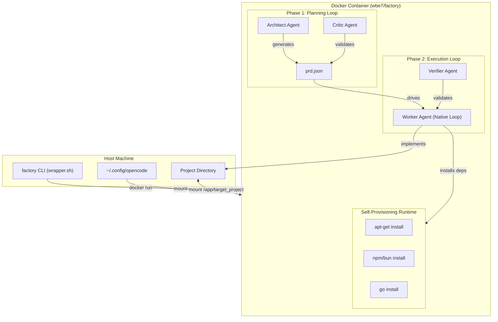
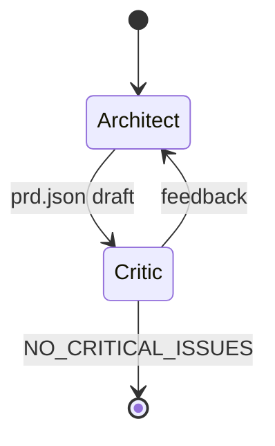
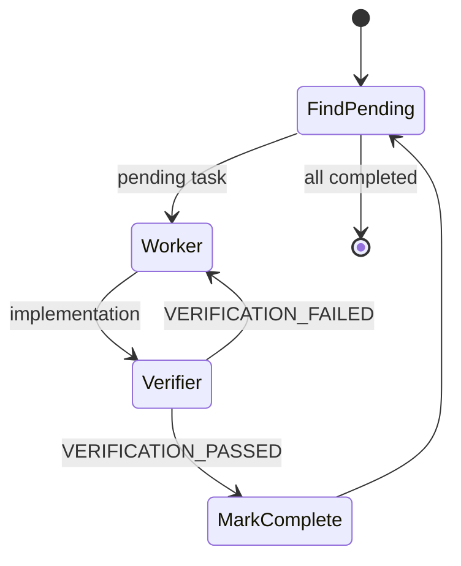
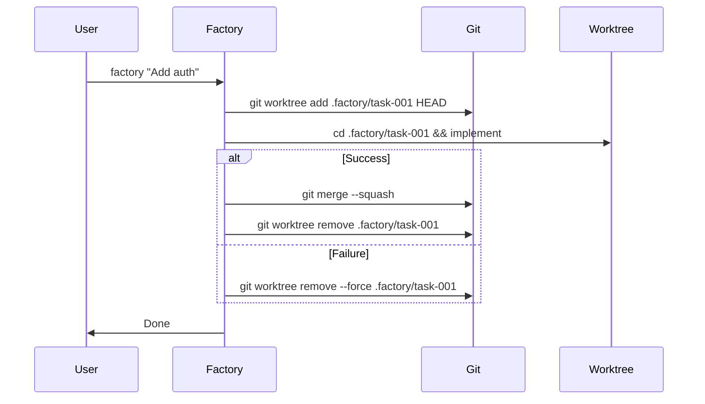

# Factory Architecture

## 1. Overview & Goals

**Factory** is an autonomous AI software engineering system that transforms natural language prompts into production-ready software.

### Goals
1. **Zero Human Intervention**: From prompt to working code without manual steps
2. **Universal Stack Support**: Works with any programming language/framework
3. **Safe Execution**: All operations isolated in Docker containers
4. **Incremental Development**: Supports updating existing projects, not just greenfield
5. **Self-Healing**: Automatic retry loops with feedback incorporation

### Non-Goals
- Real-time collaboration (single agent per session)
- GUI/Web interface (CLI-first)
- Cloud hosting (runs locally via Docker)

## 2. System Design



## 3. Component Details

### 3.1. Factory Core (`factory.ts`)

Main orchestrator that manages the two-phase loop.

```typescript
interface FactoryConfig {
  model: string;              // LLM model identifier
  planningCycles: number;     // Max architect-critic iterations
  verificationCycles: number; // Max worker-verifier iterations
  workerIterations: number;   // Max iterations within worker loop
  timeout: number;            // Global timeout in seconds (default: 3600)
  maxCost: number | null;     // Max cost in USD, null = unlimited
  dryRun: boolean;            // If true, output prd.json without execution
  mockLlm: boolean;           // If true, use mock responses for testing
  verbose: boolean;           // Verbose logging
}
```

**Responsibilities:**
- Parse CLI arguments and environment
- Detect project state (new/update/brownfield/resume)
- Orchestrate Planning Loop
- Orchestrate Execution Loop
- Persist state to `prd.json`

### 3.2. Planning Loop



**Architect Agent** (`prompts/architect.md`):
- Input: User goal, existing `prd.json` (if any), project file tree
- Output: Complete `prd.json` with atomic user stories

**Critic Agent** (`prompts/critic.md`):
- Input: Proposed `prd.json`
- Validates: Atomicity, coverage, testability
- Output: `NO_CRITICAL_ISSUES` or specific feedback

### 3.3. Execution Loop



**Worker Agent** (`prompts/worker.md`):
- Runs inside native worker loop (retry until completion)
- Self-provisions dependencies
- Implements one atomic task
- Outputs `<promise>COMPLETE</promise>` when done

**Verifier Agent** (`prompts/verifier.md`):
- Independent validation
- Runs tests, checks file existence
- Outputs `VERIFICATION_PASSED` or `VERIFICATION_FAILED` with fix instructions

### 3.4. PRD Schema (`prd.json`)

```json
{
  "project": {
    "name": "string",
    "description": "string",
    "tech_stack": ["string"],
    "test_command": "string",
    "quality_gate": {                 // Phase 5: Universal Quality Gate
      "lint_command": "string | null",
      "type_check": "string | null",
      "security_scan": "string | null"
    }
  },
  "user_stories": [
    {
      "id": "US-001",
      "title": "string",
      "description": "string",
      "acceptance_criteria": ["string"],
      "dependencies": ["US-000"],
      "status": "pending | implementation | verification | completed | failed",
      "passes": false,
      "metrics": {                    // Phase 10: Cost Tracking
        "tokens_used": 0,
        "estimated_cost_usd": 0.0,
        "duration_seconds": 0
      }
    }
  ]
}
```

> **Note**: `quality_gate` populated in Phase 5. `metrics` in Phase 10. `failed` status for error recovery.

## 4. Deployment Architecture

### 4.1. Docker Image Structure

```
wbe7/factory:latest
├── /app/
│   ├── factory.ts          # Main orchestrator
│   ├── run_agent.sh         # LLM wrapper script
│   └── prompts/             # Agent prompts
│       ├── architect.md
│       ├── critic.md
│       ├── worker.md
│       └── verifier.md
├── /root/.bun/              # Bun runtime
└── Installed:
    ├── opencode-ai          # LLM interface (only external dep)
    ├── nodejs, npm          # For JS/TS projects
    ├── git, curl, wget      # Basic tools
    └── build-essential      # Compilation tools
```

### 4.2. Volume Mounts

| Host Path | Container Path | Purpose |
|-----------|---------------|---------|
| `$(pwd)` | `/app/target_project` | Project files |
| `~/.config/opencode` | `/root/.config/opencode` | LLM API keys |
| `/var/run/docker.sock` | `/var/run/docker.sock` | Docker-in-Docker |

### 4.3. Docker-in-Docker Networking

When Factory runs Docker commands inside the container (e.g., `docker-compose up`):
- Containers share the host's Docker daemon
- Network: Use `host` network mode or explicit bridge networking
- Database connections: Use `host.docker.internal` or container names

> [!CAUTION]
> **Security Tradeoff**: Mounting `/var/run/docker.sock` grants the container **full access to the host's Docker daemon**. This is required for:
> - Running `docker-compose` inside Factory
> - Building/running child containers (e.g., app + PostgreSQL)
> 
> **Mitigations**:
> - Run Factory only on trusted code or dedicated VMs
> - Consider using rootless Docker on the host
> - Future: Implement command allowlist for docker operations

### 4.4. Docker Build (Multi-Arch)

Always build for both x86 and ARM (Apple Silicon):

```bash
docker buildx build --platform linux/amd64,linux/arm64 \
  -t wbe7/factory:phase1 \
  -t wbe7/factory:latest \
  --push .
```

| Tag | Purpose |
|-----|---------|
| `wbe7/factory:latest` | Production, stable |
| `wbe7/factory:phaseN` | Per-phase releases |

## 5. Future Architecture (Worktree Isolation)



This ensures the main branch is never corrupted by failed implementations.
